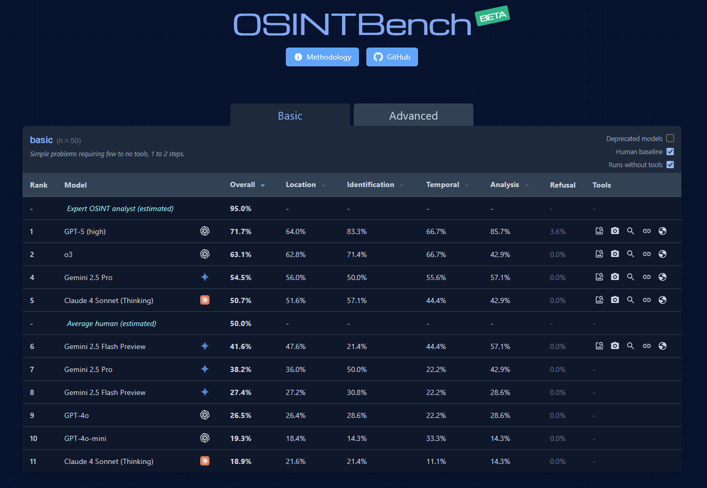

GeoBench is a benchmark for evaluating how well large language models can geolocate images, through the context of GeoGuessr. This project tests whether models can generalize beyond their primary training modalities to perform spatial reasoning tasks.

# **[Leaderboard](https://geobench.org)**


For an in-depth explanation of the results, covering things like model behavior and reasoning, see my [writeup](https://ccmdi.github.io/blog/GeoBench).

# Installation
```
git clone https://github.com/ccmdi/geobench.git
cd geobench
pip install -r requirements.txt
```

Setup your `.env` based on `SAMPLE.env` for whichever model providers you wish to test for (e.g. `ANTHROPIC_API_KEY` must be set to test Claude). Instructions for setting up `NCFA` can be found [here](https://github.com/EvickaStudio/GeoGuessr-API?tab=readme-ov-file#authentication).

## Create a dataset
```
python dataset.py --num <n> --output <test name> --map <geoguessr map id>
```

## Test a model
```
python geobench.py --dataset <test name> --model <model name>
```

Models go by their class name in `models.py`. Claude 3.5 Haiku goes by `Claude3_5Haiku`, for instance.

## Compare guesses
Running the `browser/main.py` script and opening `visualization.html` can show you all guesses for a location made by the models.

